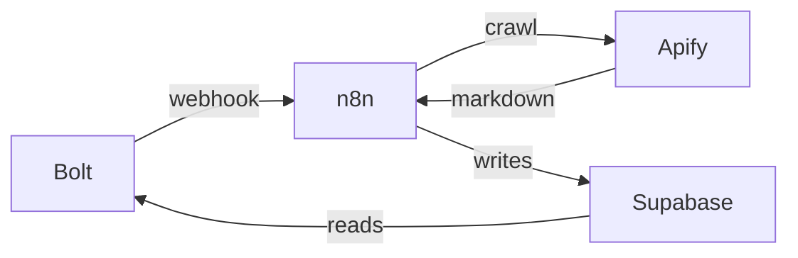

# Competitor Radar

Automated competitor intelligence for local restaurants. An owner adds their business and a competitor's menu/pricing URLs. Those pages get crawled on a schedule, each new crawl is diffed against the previous snapshot, and an LLM turns the diff into actionable signals.

> Competitor launched a $15 lunch special. This overlaps with your lunch offering. Consider testing a weekday bundle.

Restaurants are the only supported vertical in the MVP.

## Current Status

The end-to-end backend pipeline has been validated: real competitor baseline scanning works on El Chilito, controlled change detection works on Media Luna, and signals are successfully stored in Supabase.

## Architecture

- **Bolt frontend** (built elsewhere, not in this repo) — reads Supabase directly with the anon key, calls n8n webhooks to trigger work.
- **n8n** — owns all database writes using the service_role key, orchestrates every scan.
- **Apify** — crawls the competitor pages via `apify/website-content-crawler`.
- **Supabase** — Postgres, RLS on, read-only to the frontend.



## Setup

1. Create a Supabase project.
2. Run `supabase/schema.sql` in the SQL editor.
3. Run `supabase/seed.sql` for the demo business and competitor.
4. Import `n8n/workflow.json` into n8n and add the credentials listed in `n8n/README.md` (Supabase service_role, Apify, OpenAI).
5. Copy `.env.example` and fill in the values.

## Layout

```
supabase/schema.sql                     tables, indexes, RLS
supabase/seed.sql                       demo business + competitors
demo-site/index.html                    fake competitor page we edit live on stage
n8n/workflow.json                       importable n8n scan workflow
n8n/README.md                           webhook and scan contract
apify/website-content-crawler-input.json  actor input template
docs/bolt-handoff.md                    what the frontend needs
```
