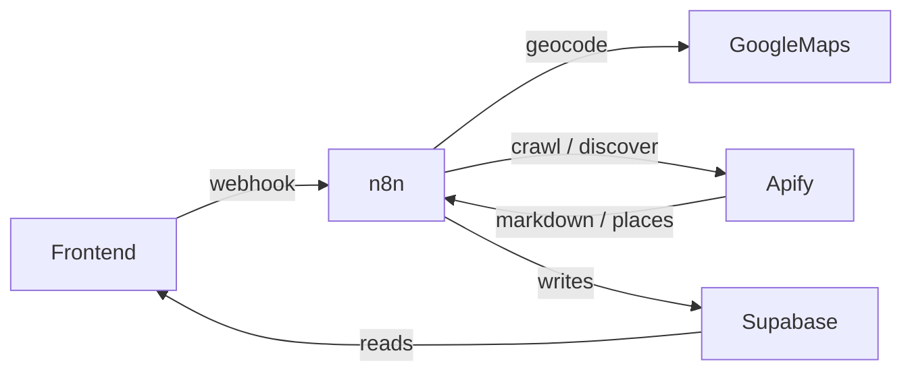

# Competitor Radar

Automated competitor intelligence for local restaurants. An owner adds their business and a competitor's menu/pricing URLs. Those pages get crawled on a schedule, each new crawl is diffed against the previous snapshot, and an LLM turns the diff into actionable signals.

> Competitor launched a $15 lunch special. This overlaps with your lunch offering. Consider testing a weekday bundle.

Restaurants are the only supported vertical in the MVP.

## Current Status

The end-to-end backend pipeline has been validated: real competitor baseline scanning works on El Chilito, controlled change detection works on Media Luna, and signals are successfully stored in Supabase.

Production n8n also supports nearby competitor discovery (address geocoding + Google Maps) and a sequential re-scan-all path so a full watchlist can be refreshed without overlapping Apify crawls.

## Architecture

- **Frontend** (`frontend/`) — reads Supabase directly with the anon key, calls n8n webhooks to trigger work.
- **n8n** — owns all database writes using the service_role key, orchestrates scans and discovery.
- **Apify** — crawls competitor websites via `apify/website-content-crawler`, and discovers nearby businesses via `compass/crawler-google-places`.
- **Google Maps Geocoding** — turns a business address into coordinates for nearby discovery.
- **Supabase** — Postgres, RLS on, read-only to the frontend.



## n8n workflows

Import all three JSON files into n8n. They ship with placeholder tokens instead of secrets — configure those values inside n8n after import. Do not commit filled copies.

| File | What it does |
| --- | --- |
| `n8n/competitor-radar-scan.json` | Scheduled and on-demand competitor website monitoring: crawl, change detection, AI analysis, snapshots and signals. Webhooks: `POST /webhook/add-competitor`, `POST /webhook/rescan`. |
| `n8n/competitor-radar-discover-nearby.json` | Address geocoding plus Apify Google Maps nearby competitor discovery. Webhook: `POST /webhook/discover-nearby`. |
| `n8n/competitor-radar-rescan-all.json` | Safely re-scans all eligible competitors sequentially to avoid concurrent Apify memory-limit failures. Webhook: `POST /webhook/rescan-all`. |

Placeholder credentials in the exported workflows include:

- `<<SUPABASE_SERVICE_ROLE_KEY>>`
- `<<APIFY_API_TOKEN>>`
- `<<OPENAI_API_KEY>>`
- `<<GOOGLE_MAPS_API_KEY>>`

The scan workflow also uses `<<SUPABASE_URL>>`. See `n8n/README.md` for the contract each workflow satisfies.

## Setup

1. Create a Supabase project.
2. Run `supabase/schema.sql` in the SQL editor.
3. Run `supabase/seed.sql` for the demo business and competitor.
4. Import the three workflows under `n8n/` into n8n and replace the placeholder credentials listed above (and in `n8n/README.md`).
5. Copy `.env.example` and fill in the values.

## Layout

```
supabase/schema.sql                          tables, indexes, RLS
supabase/seed.sql                            demo business + competitors
demo-site/index.html                         fake competitor page we edit live on stage
frontend/                                    Vite app that reads Supabase and calls n8n webhooks
n8n/competitor-radar-scan.json               website monitoring, change detection, AI signals
n8n/competitor-radar-discover-nearby.json    address geocoding + nearby Google Maps discovery
n8n/competitor-radar-rescan-all.json         sequential re-scan of the full watchlist
n8n/README.md                                webhook and scan contract
apify/website-content-crawler-input.json     actor input template
docs/bolt-handoff.md                         what the frontend needs
```
